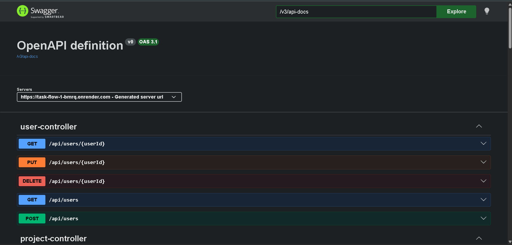

# 🚀 TaskFlow

TaskFlow is a Spring Boot REST API for managing users, projects, and tasks. It demonstrates modern backend development practices including layered architecture, DTOs, validation, exception handling, Docker, PostgreSQL, and cloud deployment.

---

## 🌐 Live Demo

**API Base URL**

https://task-flow-1-bmrq.onrender.com

**Swagger UI**

https://task-flow-1-bmrq.onrender.com/swagger-ui/index.html

---

## 📌 Features

- User Management
- Project Management
- Task Management
- RESTful APIs
- Request Validation
- Global Exception Handling
- DTO Pattern
- Entity Mapping with JPA/Hibernate
- Swagger/OpenAPI Documentation
- Docker Support
- Docker Compose for Local Development
- PostgreSQL Database
- Cloud Deployment on Render

---

## 🛠 Tech Stack

### Backend

- Java 21
- Spring Boot
- Spring Data JPA
- Hibernate
- Maven

### Database

- PostgreSQL

### API Documentation

- SpringDoc OpenAPI (Swagger)

### Containerization

- Docker
- Docker Compose

### Cloud

- Render

---

## 📁 Project Structure

```
src
├── controller
├── dto
├── entity
├── exception
├── mapper
├── repository
├── service
└── resources
```

---

## 🏗 Architecture

```
Client
   │
   ▼
Controller
   │
   ▼
Service
   │
   ▼
Repository
   │
   ▼
PostgreSQL
```

---

## ⚙️ Running Locally

### Clone Repository

```bash
git clone https://github.com/Swapnil341995/task-flow.git
cd taskflow
```

---

### Using Docker Compose

```bash
docker compose up --build
```

This starts:

- Spring Boot Application
- PostgreSQL Database

Application will be available at:

```
http://localhost:8080
```

Swagger:

```
http://localhost:8080/swagger-ui/index.html
```

---

## 🔧 Environment Variables

The application supports environment-based configuration.

| Variable | Description |
|----------|-------------|
| SPRING_DATASOURCE_URL | PostgreSQL JDBC URL |
| SPRING_DATASOURCE_USERNAME | Database Username |
| SPRING_DATASOURCE_PASSWORD | Database Password |

Example:

```
SPRING_DATASOURCE_URL=jdbc:postgresql://localhost:5432/taskflow
SPRING_DATASOURCE_USERNAME=postgres
SPRING_DATASOURCE_PASSWORD=root
```

---

## 🐳 Docker

Build Image

```bash
docker build -t taskflow .
```

Run Container

```bash
docker run -p 8080:8080 taskflow
```

---

## 📖 API Documentation

Swagger UI

```
/swagger-ui/index.html
```

OpenAPI JSON

```
/v3/api-docs
```

---

## 📚 APIs

### Users

- Create User
- Get All Users
- Get User by ID
- Update User
- Delete User

### Projects

- Create Project
- Get Projects
- Update Project
- Delete Project

### Tasks

- Create Task
- Get Tasks
- Update Task
- Delete Task

---

## 📷 Screenshots

### Swagger UI



---

## 🚀 Future Enhancements

- Spring Security
- JWT Authentication
- Role Based Authorization
- Redis Caching
- Pagination & Sorting
- File Upload
- Unit Testing (JUnit & Mockito)
- GitHub Actions CI/CD
- Kubernetes Deployment
- AWS Deployment

---

## 🎯 Learning Outcomes

This project helped me gain practical experience with:

- Building REST APIs using Spring Boot
- JPA/Hibernate Entity Relationships
- DTO and Mapper Pattern
- Exception Handling
- Validation
- PostgreSQL
- Docker
- Docker Compose
- Cloud Deployment
- API Documentation with Swagger

---

## 👨‍💻 Author

**Swapnil Bharude**

GitHub: https://github.com/Swapnil341995

LinkedIn: https://www.linkedin.com/in/swapnil-bharude-6659861a3/

---

## ⭐ Support

If you found this project useful, consider giving it a ⭐ on GitHub.